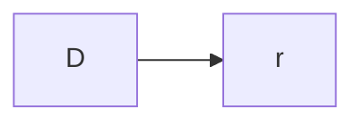

# InspectorGadget

An LLM Agent Tool & Resource utility to enable LLMs to reliably generate compliant code for arbitrary Python libraries.

Comes with a few pre-built "Canonical" grammars and supporting structures to generate clean python code:

- The Zen of Python
- faif/python-patterns
- outlines (recursive)

## Objective
To evaluate the feasibility and effectiveness of using automatically generated context-free grammars (CFGs), specifically in Lark format, combined with a constraint mechanism (like Outlines), to guide a Large Language Model (LLM) in generating syntactically valid and functionally correct code snippets for a target Python library.

While most LLMs do a decent job generating syntactically compliant code for some of python's most popular libraries, most models struggle to consistently use libraries they are unfamiliar with in their training data.

This is particularly the case with proprietary software which the LLM will only understand if it is fed into it's context window explicitly through context management. Thankfully, code is code, and we can take existing libraries and extract their usage patterns and syntax into condensed context free grammars.

## Hypothesis
1. An LLM constrained by an automatically derived Lark grammar representing a library's API will produce significantly fewer syntactically invalid code outputs compared to an unconstrained LLM for the same tasks.
2. The constrained LLM will show improved functional correctness (i.e., code runs and performs the intended sub-task) for well-defined tasks within the library's scope.

Dynamically provisioning tools and resources to Software Agents will give LLMs the context they need to write correct code. 

## Dependencies

### `inspect`

The inspect module provides several useful functions to help get information about live objects such as modules, classes, methods, functions, tracebacks, frame objects, and code objects. For example, it can help you examine the contents of a class, retrieve the source code of a method, extract and format the argument list for a function, or get all the information you need to display a detailed traceback.

There are four main kinds of services provided by this module: type checking, getting source code, inspecting classes and functions, and examining the interpreter stack.

### `ast`

The ast module helps Python applications to process trees of the Python abstract syntax grammar. The abstract syntax itself might change with each Python release; this module helps to find out programmatically what the current grammar looks like.

An abstract syntax tree can be generated by passing ast.PyCF_ONLY_AST as a flag to the compile() built-in function, or using the parse() helper provided in this module. The result will be a tree of objects whose classes all inherit from ast.AST. An abstract syntax tree can be compiled into a Python code object using the built-in compile() function.

### `outlines`

### `networkx`

Structures the data for LLMs to perform tool choice

### `pandas` 

---

## Components & Setup

Given a target library (ie. NetworkX), InspectorGadget will perform:

### 1. Introspection 
Uses `inspect` and  `ast` to extract public functions, classes, methods, and their signatures.
Investigates each d

 
### 2. Grammar Generation
- A Python script that takes the output of the introspection tool (the JSON signature map) and automatically generates a `networkx_api.lark` grammar file.

  - **Initial Version**: Generates rules for function calls with generic argument parsing (similar to the scaffold shown previously).
  - **Potential Enhancements**: Parse signatures more deeply to create more specific rules for arguments (handling positional, keyword, *args, **kwargs, basic type mapping like string/number/boolean/None). Handle class instantiation and method calls.

### System Prompt Derivation

### RegEx Updates

### Constraint Enforcement
- `outlines-dev/outlines` or a similar library that integrates an LLM with a Lark grammar for generation.

### Evaluation 
- A Python environment where generated code snippets can be executed and evaluated.

## Methodology

### Step 1: Introspection & Grammar Generation
- Run the introspection script (`_temp_nx_inspect.py`) on networkx.
- Run the grammar generator script to produce `networkx_api.lark` from the introspected signatures.

### Step 2: Task Definition
- Define a diverse set of specific, atomic tasks using networkx functionality. Examples:
  - "Create an empty Graph object."
  - "Create a complete graph with 5 nodes."
  - "Add an edge between node 'A' and node 'B' to graph G."
  - "Calculate the degree centrality for graph G."
  - "Find the shortest path between nodes 'X' and 'Y' in graph G using Dijkstra's algorithm."
  - "Instantiate a DiGraph object." (If classes are included)
  - "Call the add_node method on graph object my_graph with node ID 1." (If methods are included)

### Step 3: Generation
- For each task, prompt the LLM with the Outlines + Lark grammar constraint to generate the corresponding networkx code snippet.
- **(Control Group)**: For each task, prompt the same LLM without the grammar constraint to generate the code snippet.

### Step 4: Execution & Evaluation
- For each generated snippet (constrained and unconstrained):
  - **Syntactic Check**: Does it parse as valid Python? (The constrained generation should largely guarantee this if the grammar is correct). Does it conform to the Lark grammar?
  - **Execution Check**: Attempt to execute the snippet. Does it run without raising Python exceptions (e.g., TypeError, NameError, AttributeError)?
  - **Functional Check**: If execution succeeds, does the resulting state or output match the intended task? (e.g., verify the created graph has 5 nodes and is complete). This might require manual inspection or simple assertion scripts.

## Metrics
- Percentage of Syntactically Valid outputs (Constrained vs. Unconstrained).
- Percentage of Exception-Free Executions (Constrained vs. Unconstrained).
- Percentage of Functionally Correct outputs (Constrained vs. Unconstrained).
- Qualitative analysis of common failure modes (e.g., incorrect argument types, misunderstanding library semantics, hallucinated parameters/methods).

## Expected Outcomes & Challenges

### Expectation
Constrained generation will yield near-perfect syntactic validity according to the grammar. Execution success will be higher but not perfect (semantic errors within valid syntax are possible). Functional correctness will likely be the biggest challenge, depending on LLM capability and grammar specificity.

### Challenges
1. **Grammar Fidelity**: Accurately representing complex Python signatures (defaults, unions, complex types, */**) in Lark is non-trivial.
2. **Semantic Gaps**: The grammar enforces syntax, not semantic understanding. The LLM still needs to choose the right function and arguments for the task, even if constrained to valid options.
3. **State & Context**: Simple snippets might work, but tasks requiring multi-step operations or awareness of previous state (e.g., operating on a graph created in a prior step) add complexity. The grammar needs to accommodate variable names and sequences of operations.
4. **Introspection Limits**: `inspect` might struggle with C extensions or dynamically generated methods/attributes.

This experimental design provides a framework for systematically testing the core idea. We can start with the simpler versions (function calls, basic grammar) and iteratively enhance the introspection, grammar generation, and task complexity.

## Guiding Principles (Zen Applied):
1. Beautiful is better than ugly.
2. Explicit is better than implicit.
3. Simple is better than complex.
4. Complex is better than complicated.
5. Flat is better than nested.
6. Sparse is better than dense.
7. Readability counts.
8. Special cases aren't special enough to break the rules.
9. Although practicality beats purity.
10. Errors should never pass silently.
11. Unless explicitly silenced.
12. In the face of ambiguity, refuse the temptation to guess.
13. There should be one-- and preferably only one --obvious way to do it.
14. Although that way may not be obvious at first unless you're Dutch.
15. Now is better than never.
16. Although never is often better than *right* now.
17. If the implementation is hard to explain, it's a bad idea.
18. If the implementation is easy to explain, it may be a good idea.
19. Namespaces are one honking great idea -- let's do more of those!

## Phased Experimental Breakdown:
Phase 1: The Simplest Thing That Could Possibly Work
Goal: Validate the core loop: Introspect -> Generate Basic Grammar -> Constrain LLM -> Check Syntax/Execution for single, top-level function calls with generic arguments.
Introspection (Simple & Explicit):
Use the existing script (_temp_nx_inspect.py) to extract only top-level function names from networkx.
Ignore signatures entirely for now, or use a universal (*args, **kwargs) placeholder if the generation tool requires it. Explicitly state this limitation.
Grammar Generation (Simple, Flat & Sparse):
Generate the most basic Lark grammar:
Apply to _temp_nx_ins...
WS
This is flat, readable, and explicitly simple.
Tasks (Simple & Explicit):
Define tasks that involve calling single networkx functions with basic literal arguments.
networkx.complete_graph(5)
networkx.path_graph(3)
networkx.circular_ladder_graph(4)
Constrained Generation:
Use Outlines (or similar) with the LLM and the generated grammar. Prompt with the task description.
Evaluation (Focus on Core Mechanics):
Metric 1 (Grammar Conformance): Did the output parse correctly according to the Lark grammar? (Should be nearly 100% if Outlines works).
Metric 2 (Basic Execution): Does the generated one-liner run in Python without immediate exceptions like SyntaxError or NameError (assuming networkx is imported)? We aren't deeply checking args yet.
(Control Group): Generate code for the same simple tasks without constraints. Compare Metric 2 results.
Zen Focus: Simplicity, Explicitness, Readability, Practicality (Is the basic plumbing feasible?). Getting something working now.
Phase 2: Handling Arguments (Adding Necessary Complexity Cleanly)
Goal: Improve the grammar to represent positional and keyword arguments, based on actual function signatures, using basic types.
Introspection (Explicit Signatures):
Enhance the script to capture and parse the signature string obtained from inspect.signature().
Identify parameter names, kinds (positional-only, positional-or-keyword, keyword-only, var-positional, var-keyword), and attempt to map default values to basic types (string, number, bool, None). Log errors/ambiguities.
Grammar Generation (Complex is Better than Complicated):
Generate a more structured grammar:
Apply to _temp_nx_ins...
WS
This adds complexity but aims for a clean, readable representation of function calls. Refuse the temptation to guess complex type mappings yet.
Tasks (Targeting Arguments):
Define tasks requiring specific arguments:
networkx.barbell_graph(5, 2) (positional)
networkx.gnp_random_graph(10, 0.5, directed=True) (positional + keyword)
networkx.draw(G, with_labels=False, node_color='red') (keywords, assumes G exists - see Phase 3)
Evaluation (Checking Argument Handling):
Metric 1 (Grammar Conformance): Still expect near 100%.
Metric 2 (Execution): Does it run without TypeError due to wrong argument count/keywords?
Metric 3 (Basic Functional): For simple cases like graph generators, does the output graph have roughly the expected properties (e.g., node count)? Manual check or simple assertions.
(Control Group): Compare Metric 2 and 3.
Zen Focus: Handling necessary complexity cleanly, Explicit argument representation, Readability of the grammar, Refusing ambiguity in type mapping for now.
Phase 3: State, Sequences, and Methods (Practicality & Scope)
Goal: Handle simple sequences (assignment) and method calls on objects. This makes the system more practical.
Introspection (Classes & Methods):
Add introspection for networkx classes (e.g., nx.Graph, nx.DiGraph).
For discovered classes, introspect their public methods and signatures (similar to Phase 2 for functions).
Grammar Generation (Careful Complexity):
Introduce rules for instantiation and method calls:
Apply to _temp_nx_ins...
.
This adds significant complexity (especially tracking variable names implicitly via NAME), but is crucial for practical use. Keep the sequence logic simple initially.
Tasks (Sequential & Method-Based):
Define tasks requiring multiple steps or methods:
"Create a Graph object G. Add node 1 to G. Add an edge between node 1 and node 2 to G."
G = nx.Graph()
G.add_node('A')
G.add_edge('A', 'B', weight=3)
Evaluation (Functional Sequences):
Evaluate syntactic correctness and execution for the entire sequence.
Metric 4 (Functional Sequence): Does the final state after the sequence match the task description? (e.g., check G.nodes, G.edges.data()).
(Control Group): Compare execution and functional correctness for sequences.
Zen Focus: Practicality (handling common OO patterns), Explicit support for assignment/methods, Errors should not pass silently (failures in sequences are important), Now is better than never (for core method call capability).